---
<h1 align="center">👨🏻‍💻 About Me</h1>

I am **Sunny Shaban Ali Allana**, a sophomore pursuing a **Bachelor of Science in Computer Science (BSCS)** at FAST NUCES, Karachi. Enthusiastic about **Full-Stack Web Development, Data Analytics, and Artificial Intelligence**, I'm currently immersed in mastering **Django** and learning **Next.js** to further enhance my skills ⚡

 

> ### I am deeply committed to the journey of <strong>continuous learning</strong>, the art of <strong>innovative creation</strong>, and the joy of <strong>meaningful contribution</strong> to impactful real-world projects

 

<h3 align = "center">Explorer | Developer | Analyst | Enthusiast</h3>

 

---

  <h1 align="center">✨ Let's Learn, Grow, & Connect</h1>
  

    
    
    
    <a  href="https://discordapp.com/users/sunny.allana#6221">
    
    
  

   

---

  <h1>🛠 Technical Skills</h1>
    

My journey into the realm of technology and web solutions began with a genuine curiosity for how coding and development could reshape online experiences and functionalities. Throughout my academic journey, I have honed my skills in **C, C++, Python, HTML, CSS, JavaScript**, and various web development frameworks, including **Django**. These tools have empowered me to create engaging and responsive websites, bringing ideas to life on the digital frontier.

Motivated by a passion for continuous learning, I am also expanding my expertise in back-end technologies such as **Node.js and Express.js**. This allows me to build robust and scalable web applications, contributing to a seamless user experience. Additionally, my fascination with Artificial Intelligence has led me to explore machine learning concepts and frameworks, adding a layer of intelligence to my web development projects.

I thrive on challenges and am currently exploring new frontiers by delving into the world of cloud technologies, aiming to leverage platforms like **AWS** and **Azure** for enhanced scalability and efficiency.

If you share my enthusiasm for **Web Development** and **Artificial Intelligence**, or if you have exciting opportunities to discuss, I'd love to connect with you! Let's collaborate and explore how we can shape the digital and intelligent future together.

 

> ### "In every challenge lies an opportunity to grow, embrace the process, and relish the victories along the way!"

 

**I'm passionate about fostering open-source contributions. Let's join forces and create together!**

 

  
 
  
  
  
  
  
  
  
  
  
  
  
  
  
  
  
  
  
  
  
  
  
   
  
  
  
  
  

 

  Seeking opportunities to advance web development skills, delve into AI, and contribute to open-source initiatives.

 

---
  <h1 align="center">💻 Some Of My Projects</h1>

  <table bordercolor="#66b2b2">

<tr>
  <td width="50%" valign="top">
      <h3 align="center">Coders Cup - ACM Event Registration</h3>
         
        <a target="_blank" href="https://github.com/sunnyallana/coders-cup">
            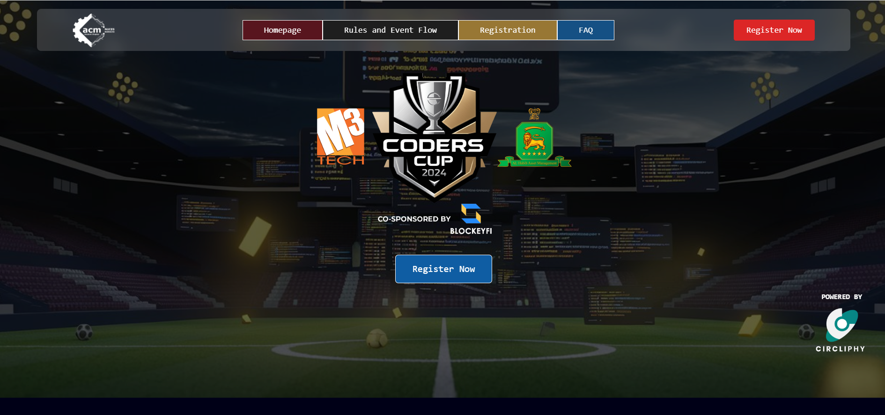
        </a>
         
        

           
           
        

        
Developed a high-performance event registration application for ACM, achieving remarkable success with over 2,500 users and 900 registrations. Implemented robust security features including Google Captcha V2, Axios protection against XSS and CSRF, and deployed on Azure with a CI/CD pipeline for optimal scalability and performance.

  </td>
  <td width="50%" valign="top">
      <h3 align="center">Divide & Conquer Algorithms Visualiser</h3>
         
      
         
        

    
  
      

        
Created an interactive Algorithm Visualizer to explore complex algorithms like Integer Multiplication and Closest Pair of Points. Developed step-by-step animations with customizable zoom and pan features, enabling comprehensive visual analysis of algorithmic processes.

    </td>
  </tr>

<tr>
  <td width="50%" valign="top">
      <h3 align="center">ConvoNest</h3>
         
        <a target="_blank" href="https://github.com/sunnyallana/convo-nest">
            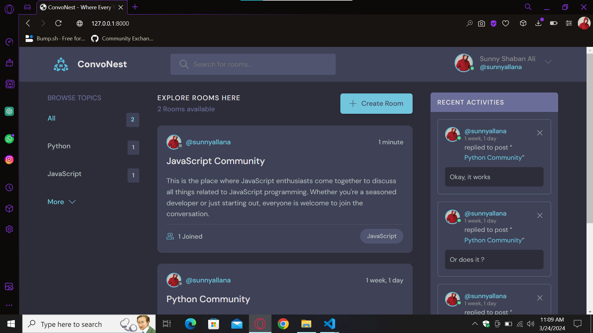
        </a>
         
        

           
           
        

        
Utilized <strong>Django framework</strong> to develop ConvoNest, incorporating <strong>SQLite</strong> for data management. Enabled users to create topic-based rooms and communicate with others. Resulted in the creation of a dynamic platform where users can engage in discussions on various topics within dedicated rooms, fostering community interaction and knowledge sharing

</td>
    <td width="50%" valign="top">
      <h3 align="center">DealerTrack Insights</h3>
         
      <a target="_blank" href="https://github.com/sunnyallana/dealerTrack-insights">
            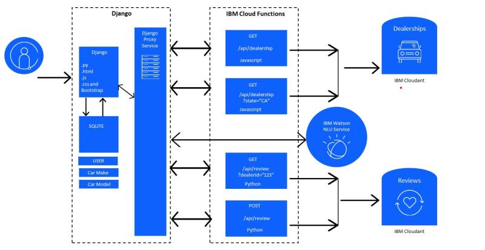
        </a>
         
        

    
  
      

        
Leveraged <strong>Django</strong> with <strong>SQLite</strong> for efficient data management, while integrating <strong>Cloudant</strong> and <strong>IBM Watson API</strong>. Deployed using <strong>Kubernetes</strong> on <strong>IBM Cloud</strong> for scalable performance. Enhanced user engagement by enabling review submission and viewing functionalities, ensuring accurate sentiment analysis with <strong>IBM Watson</strong>.

    </td>
  </tr>
  
  <tr>
    <td width="50%" valign="top">
      <h3 align="center">Invoice Wizard</h3>
         
        <a target="_blank" href="https://github.com/sunnyallana/invoice-wizard">
            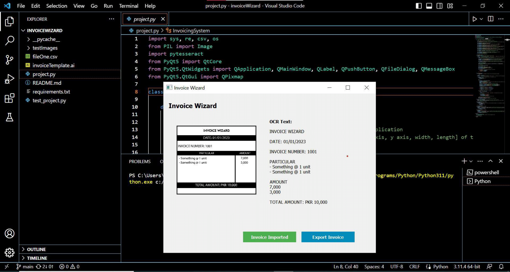
        </a>
         
        

           
    
      

        
The Invoice Wizard is a desktop application implemented in <strong>Python</strong> that makes use of <strong>PyQt5</strong>, <strong>Pillow</strong>, and <strong>Pytesseract</strong> libraries allowing users to import invoice images, utilize Optical Character Recognition (OCR) to extract relevant information, and export the extracted data into a CSV file.

    </td>
    <td width="50%" valign="top">
      <h3 align="center">SmartTrack Attendance Management</h3>
         
      <a target="_blank" href="https://github.com/sunnyallana/smartTrack">
            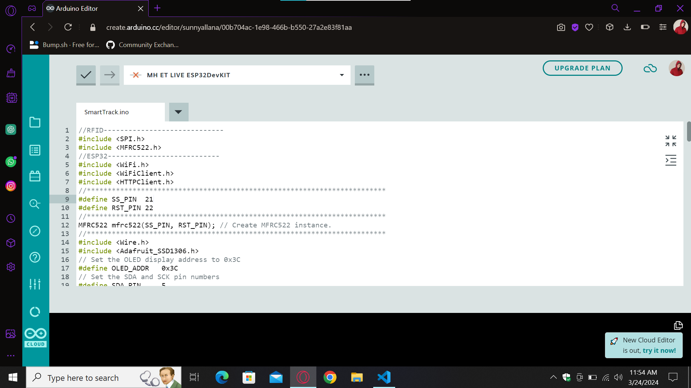
        </a>
         
        

    
        
      

        
Developed SmartTrack Attendance Management System using <strong>Esp32 DevKit</strong>, <strong>RFID scanner</strong>, and <strong>OLED display</strong> for real-time attendance tracking, with a robust web interface powered by <strong>SQL</strong>, <strong>PHP</strong>, <strong>HTML</strong>, and <strong>CSS</strong> for efficient administration and secure data storage.

    </td>
  </tr>
</table>

  ---

  <h1>🥇 Some Of My Badges</h1>

  
  
  
  
  
  <a href="https://api.badgr.io/public/assertions/njHKqJJISj2qeCSh7LrpCQ?identity__email=study.sunnyallana%40gmail.com">
      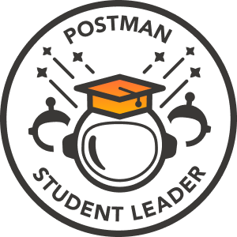
  </a>
  <a href="https://api.badgr.io/public/assertions/4NvkIsOXTy-wKBKlK8vfVQ?identity__email=study.sunnyallana%40gmail.com">
      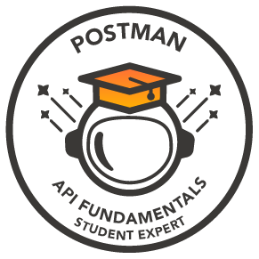
  </a>
  
  <a href="https://www.credly.com/badges/df0dba9b-e56d-482a-a652-255d8be6fd8b">
      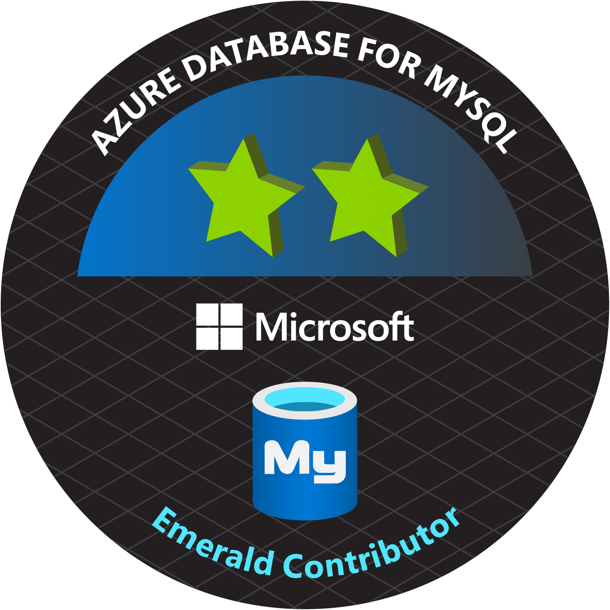
  </a>
  <a href="https://www.credly.com/badges/d14372c6-5828-4eab-8600-2c2cc01be06f">
      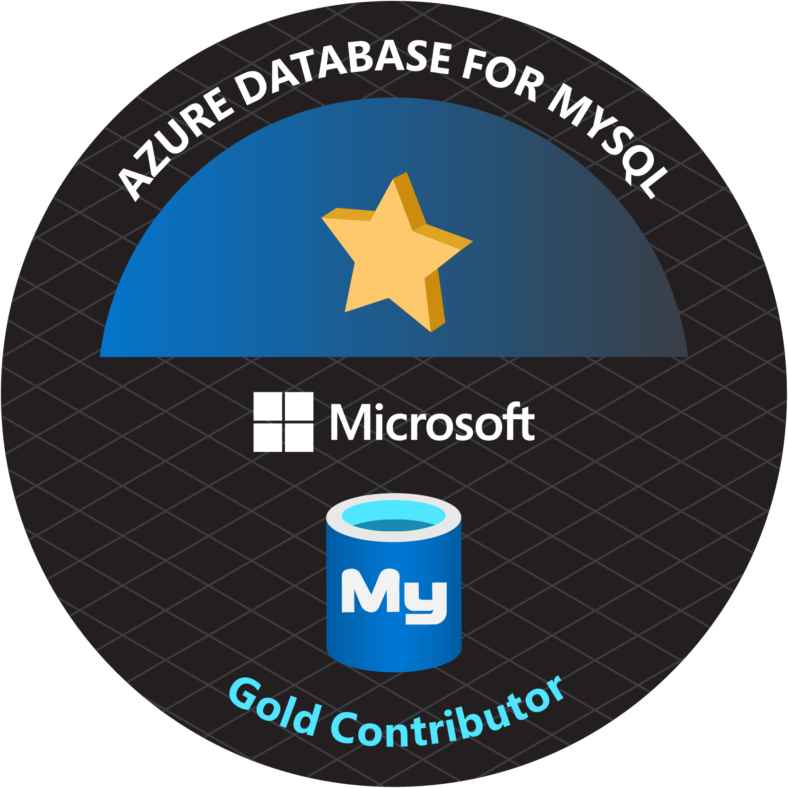
  </a>
  <a href="https://www.credly.com/badges/ab381004-8711-49b3-bd8b-11fe778d83e5">
      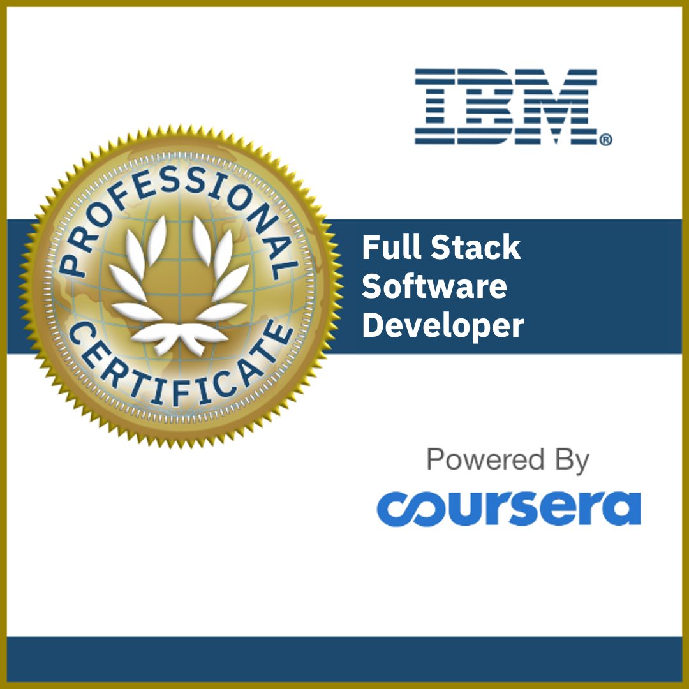
  </a>
  <a href="https://www.credly.com/badges/0be18a5e-43a3-4b25-a689-7ad630578ff7">
      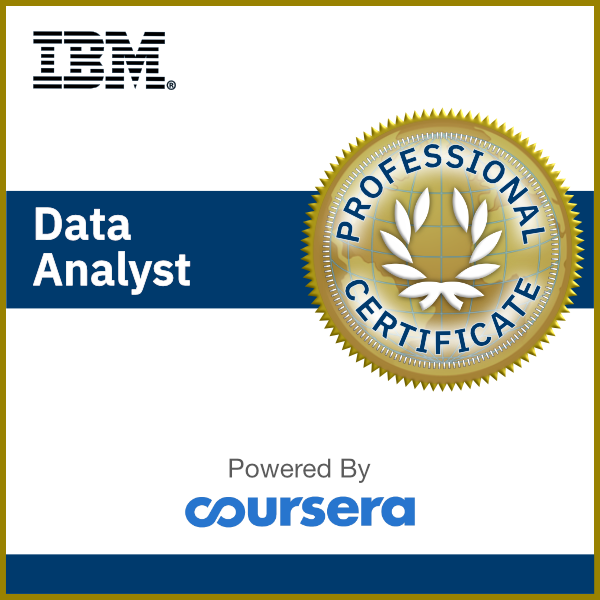
  </a>
  <a href="https://www.credly.com/badges/ae081eb5-404e-4e5a-8a1f-6f18de7b520e">
      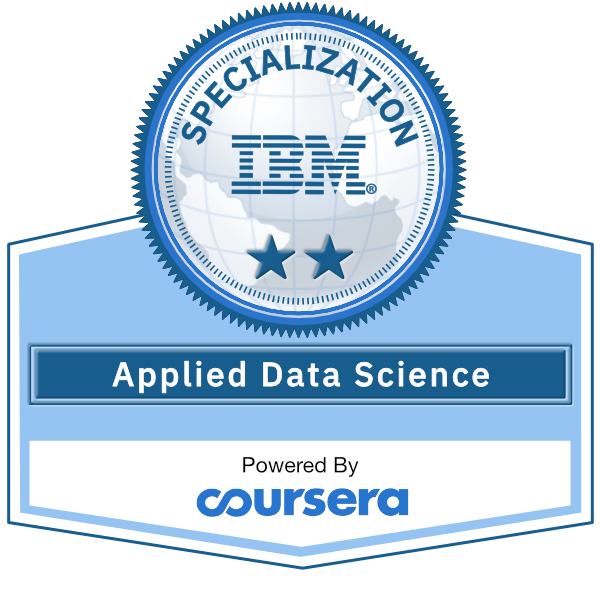
  </a>

  ---
  
  # ⚙️ GitHub Analytics
    
  <table>
    <tr>
     <td></td>
      <td></td>
    </tr>
  </table>

  

    

  

---
  # 📈 Contribution Graph  
  

---

