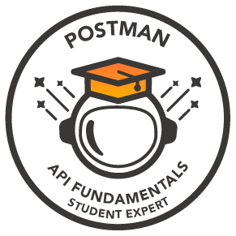
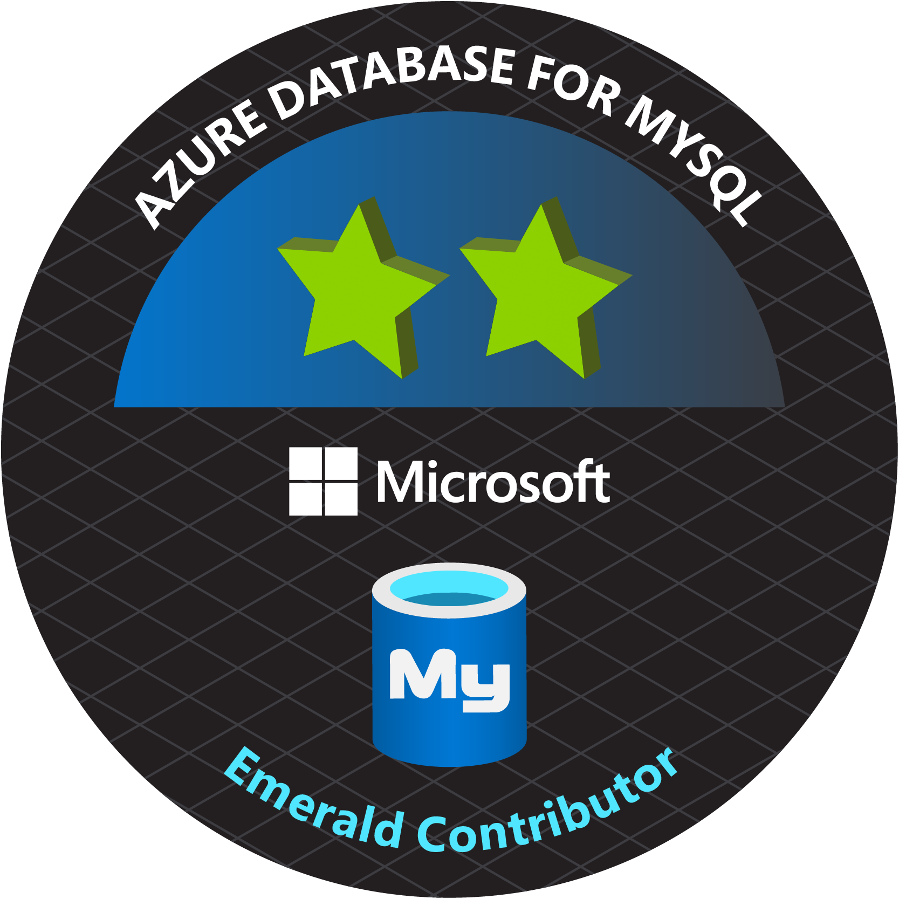
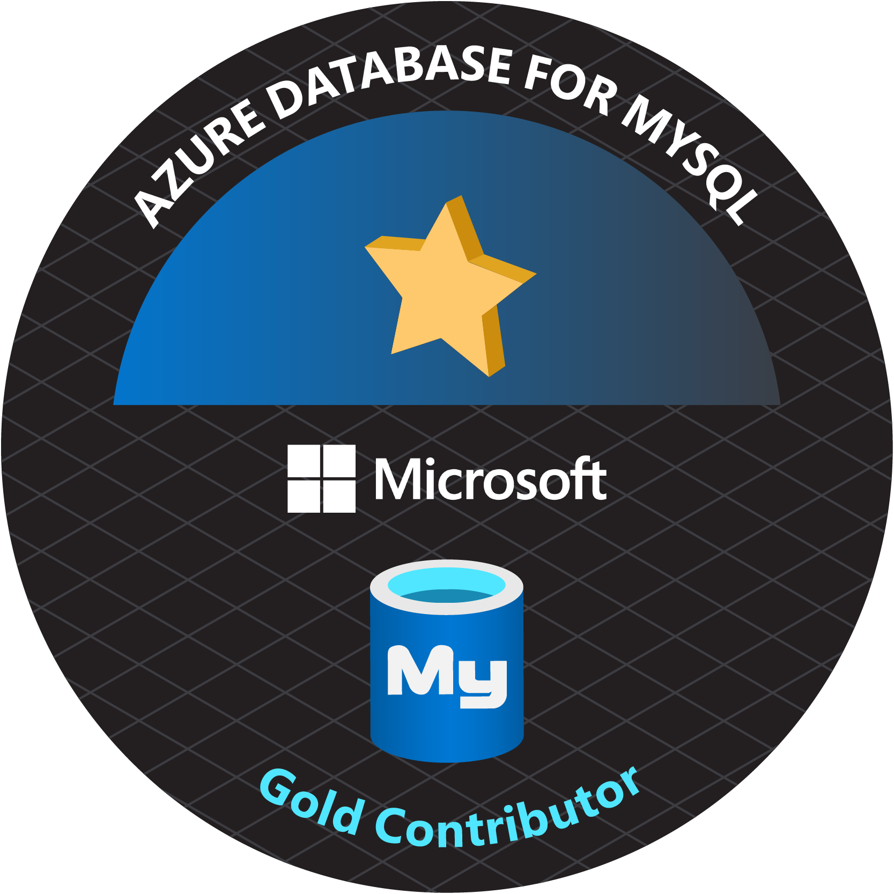
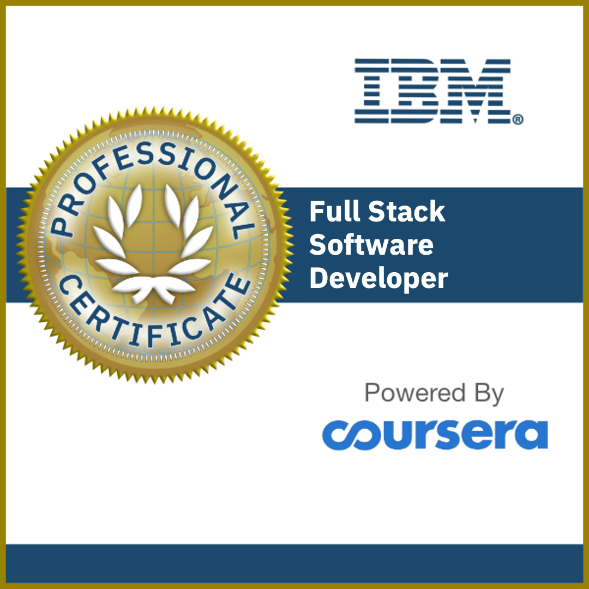
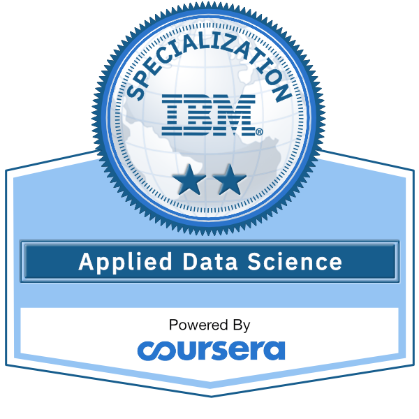

---
<h1 align="center">👨🏻‍💻 About Me</h1>

Sunny Shaban Ali is a **Bachelor of Science in Computer Science (BSCS)** senior student at **FAST NUCES, Karachi**, with a keen focus on **Software Engineering**. His technical repertoire spans **Rust, C/C++, Python, Next.js, and MERN Stack** with hands-on experience across freelance, open-source, academic, and self-initiated projects. 

 

> ### Currently, he is deepening his expertise in **Rust** through practical implementations.

 

---

  <h1 align="center">✨ Let's Learn, Grow, & Connect</h1>
  

    
    
    
    <a  href="https://discordapp.com/users/sunny.allana#6221">
    
    
  

  
 

---

  <h1>🛠 Technical Skills</h1>
    

Beyond conventional development, Sunny thrives in **Quantum Computing, Computer Vision, and Cybersecurity**—domains he explores passionately for both learning and fun. A lifelong learner, he holds **25+ certifications** from industry leaders including **Microsoft, MongoDB, Postman, and GitHub**.

As an **Emerald Contributor** for Microsoft Azure DB for MySQL, **Subject Matter Expert (SME)** for MongoDB reviewing certification content, and **Postman Student Leader** championing API literacy, Sunny actively shapes the tech ecosystem. Driven by curiosity and impact, he embraces collaborative opportunities to build, break, and refine systems—always with an eye on innovation.

Driven by curiosity and impact, Sunny embraces collaborative opportunities to build, break, and refine systems—always with an eye on innovation.

 

He uses ***Arch*** btw.

 

  
 
  
  
  
  
  
  
  
  
  
  
  
  
  
  
  
  
  
  
  
  
  
   
  
  
  
  
  

 

  Seeking opportunities to advance web development skills, delve into AI, and contribute to open-source initiatives.

 

---
  <h1 align="center">💻 Some Of My Projects</h1>

  <table bordercolor="#66b2b2">

<tr>
  <td colspan="2" valign="top">
      <h3 align="center">Agentic Multi-Modal Triage of Citizen Flood Reports at Scale · Final Year Project</h3>
         
        
         
        

           
          
        

        
Constructed and released the <strong>Close-View Flood Dataset (CVFD)</strong> on Kaggle: 7,855 images with pixel-wise semantic segmentation masks across 3 operationally motivated rescue classes, with inter-annotator agreement of Cohen's κ = 0.81. Benchmarked 7 vision architectures on CVFD and identified fine-tuned <strong>DINOv3</strong> as optimal at <strong>98.84% accuracy (±0.08)</strong> with 21.6M parameters, matching Swin Transformer at one-quarter the parameter count. Built an agentic triage pipeline fusing a CV Agent (DINOv3 + SAM 3) with a zero-shot multilingual LM Agent into a composite priority scorer, validated via Spearman's ρ and Cohen's κ.

  </td>
</tr>

<tr>
  <td width="50%" valign="top">
      <h3 align="center">LineSentry · Industrial IoT at Dawlance</h3>
         
        
         
        

           
          
        

        
Real-time analytics platform monitoring <strong>OEE</strong>, <strong>MTTR</strong>, and <strong>MTBF</strong> across factory machinery via <strong>Chart.js</strong> dashboards. Ingests live PLC signals through <strong>Raspberry Pi</strong> (<strong>S7 protocol in Rust</strong>) and aggregates via <strong>MongoDB</strong> pipelines, with drag-and-drop department layouts, intelligent breakdown alerts, and automated email-based analytics reporting. Replaced legacy SAP and a €60K vendor solution at Dawlance.

  </td>
    <td width="50%" valign="top">
      <h3 align="center">Trainiac · Agentic AI Fitness at MazikGlobal</h3>
         
      
         
        

    
  
      

        
AI fitness platform anchored by a modular <strong>LangChain</strong> tool-calling agent (mood tracking, RAG-based Q&A, report generation, profile updates) with CNN-based real-time posture detection in <strong>TensorFlow</strong> at <strong>94% accuracy</strong>. Video-based workout-plan generation via <strong>FastAPI</strong> and a <strong>React</strong> progress dashboard; MongoDB-stored evolving user summaries cut chatbot response latency on repeat interactions.

    </td>
  </tr>

<tr>
  <td width="50%" valign="top">
      <h3 align="center">Jild · AI Skincare Analysis · HackOps'25</h3>
         
        
         
        

           
          
        

        
<strong>1st Runner-Up at HackOps'25</strong> for an AI skincare analyzer detecting acne and dark circles at <strong>83.8% mAP@50</strong> on a ~2k-image dataset, returning severity scores and matched product/routine recommendations. <strong>React + Tailwind + MUI</strong> frontend on Vercel with a Dockerized <strong>Flask</strong> inference service and <strong>Supabase</strong>, IaC via <strong>Terraform</strong>; <strong>GitHub Actions CI/CD</strong> with SonarCloud, GitGuardian, and Dependabot held critical vulnerabilities at zero through release.

  </td>
    <td width="50%" valign="top">
      <h3 align="center">Hyprland Starter · Open-Source · 880+ ★</h3>
         
      
         
        

    
  
      

        
Contributed an open-source screenshot tool to <strong>ML4W Hyprland Starter</strong>, a popular Arch Linux desktop project (<strong>880+ GitHub stars</strong>); supports region, fullscreen, interactive, clipboard, and color-picker capture, all triggered via Print Screen shortcuts. Merged 8 keyboard shortcuts (volume, brightness, mute, microphone, WiFi, screen refresh) and a lockscreen display fix for 1920×1080 monitors, across <strong>2 pull requests upstream</strong>.

    </td>
  </tr>

  <tr>
    <td width="50%" valign="top">
      <h3 align="center">Coders Cup · ACM Event Registration</h3>
         
        
         
        

           
          
        

        
Built the Coders Cup contest portal in <strong>React + Tailwind</strong> on <strong>Azure Web App</strong> with multi-field client validation and Google reCAPTCHA v2, handling <strong>2,500+ users</strong> and <strong>900+ team registrations</strong> for ACM NUCES. Ranked top-3 on Google for "Coders Cup" keywords with 9,900 page views; shipped via GitHub Actions CI/CD and awarded <strong>Special Mention</strong> for leading platform development.

    </td>
    <td width="50%" valign="top">
      <h3 align="center">Automated Invoice Processor · Python OCR</h3>
         
        
         
        

           
  
      

        
AI-powered OCR tool using <strong>Python</strong>, <strong>PyTesseract</strong>, <strong>Matplotlib</strong>, and <strong>PyQt5</strong> to parse <strong>100+ invoice formats</strong> at <strong>93% accuracy</strong>, reducing manual processing time by <strong>40%</strong> through automated extraction and validation.

    </td>
  </tr>
</table>

  ---

  <h1>🥇 Some Of My Badges</h1>

  

  
  
  
  
  
  
  
  
  
  
  
  
  

  ---
  
  # ⚙️ GitHub Analytics
    
  <table>
    <tr>
     <td></td>
      <td></td>
    </tr>
  </table>

  

    

  

---
  # 📈 Contribution Graph  
  

---

