<div align="center">


<a href="https://github.com/sunnyallana">
  
</a>

<br/>

<a href="https://www.linkedin.com/in/sunnyallana" target="_blank"></a>
<a href="https://github.com/sunnyallana" target="_blank"></a>
<a href="mailto:contact.sunnyallana@gmail.com"></a>
<a href="https://discordapp.com/users/sunny.allana#6221"></a>
<a href="https://www.instagram.com/imsunnyallana/"></a>


</div>

<br/>

<h2 align="center">⚡ $ whoami</h2>

Senior **BSCS** student at **FAST NUCES, Karachi**, crafting software across **Rust, C/C++, Python, Next.js, and the MERN stack** — with hands-on experience spanning freelance, open-source, academic, and self-initiated projects. Beyond conventional development, he explores **Quantum Computing, Computer Vision, and Cybersecurity** for both learning and fun.

```rust
struct SunnyShabanAli;

impl Developer for SunnyShabanAli {
    fn location(&self) -> &str { "Karachi, Pakistan 🇵🇰" }
    fn education(&self) -> &str { "BSCS Senior @ FAST NUCES" }
    fn stack(&self) -> Vec<&str> { vec!["Rust", "C/C++", "Python", "Next.js", "MERN"] }
    fn obsessions(&self) -> [&str; 3] { ["Quantum Computing ⚛️", "Computer Vision 👁️", "Cybersecurity 🔐"] }
    fn currently(&self) -> &str { "Deepening Rust — one segfault-free build at a time 🦀" }
    fn os(&self) -> &str { "Arch Linux (btw) 🐧" }
}
```

<div align="center">

| 🏅 Highlight | 📌 Detail |
|:---|:---|
| 🥈 **1st Runner-Up — HackOps'25** | AI skincare analyzer · 83.8% mAP@50 |
| 💎 **Emerald Contributor** | Microsoft Azure DB for MySQL |
| 🧠 **Subject Matter Expert** | MongoDB — certification content reviewer |
| 🚀 **Postman Student Leader** | Championing API literacy |
| 🏭 **Top Intern · Golden Key — Dawlance** | LineSentry replaced a €60K vendor solution · live on 4 machines |
| ⭐ **Open Source** | ML4W Hyprland Starter (880+ ★) — 2 PRs merged upstream |
| 📜 **25+ Certifications** | Microsoft · IBM · MongoDB · Postman · GitHub |

<br/>

*Driven by curiosity and impact — always up for collaborations that **build, break, and refine** systems.*

</div>

<br/>

---

<h2 align="center">🛠️ Tech Arsenal</h2>

<div align="center">

#### 💻 Languages


#### 🎨 Frontend


#### ⚙️ Backend · AI · Data


#### 🗄️ Databases & Cloud


#### 🔧 DevOps & Tools


</div>

<br/>

<details>
<summary><b>🖥️ The Battlestation — Arch + Hyprland (btw)</b></summary>
<br/>


</details>

<br/>

---

<h2 align="center">🚀 Featured Builds</h2>

  <table bordercolor="#66b2b2">

<tr>
  <td colspan="2" valign="top">
      <h3 align="center">Scribe · The Collaborative LaTeX Editor You Can Actually Own</h3>
        <br />
        <a target="_blank" href="https://github.com/sunnyallana/scribe">
            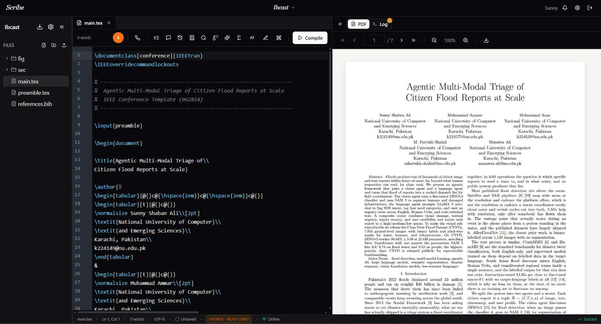
        </a>
        <br />
        <p align="center">
          <br>
          <a href="https://github.com/sunnyallana/scribe" target="_blank">
            
          </a>
        </p>
        <p>Self-hostable <strong>Overleaf alternative</strong> where one <strong>Rust (Axum)</strong> binary runs the whole API: REST routes, a <strong>Yjs CRDT</strong> hub for multi-cursor editing, a <strong>Redis</strong>-backed compile queue, and an AI proxy wired for OpenAI, Anthropic, Gemini, Ollama, LM Studio, or any OpenAI-compatible endpoint. Collaborators get <strong>WebRTC</strong> voice chat right in the editor. The <strong>Tauri 2</strong> desktop bundles the <strong>Tectonic</strong> engine and mirrors projects to <strong>SQLite</strong>, so a clean Windows machine compiles a paper on first launch and offline edits sync back through three-way conflict resolution. Ships as signed MSI/NSIS installers, licensed <strong>AGPL-3.0</strong>.</p>
  </td>
</tr>

<tr>
  <td colspan="2" valign="top">
      <h3 align="center">Agentic Multi-Modal Triage of Citizen Flood Reports at Scale · Final Year Project</h3>
        <br />
        <a target="_blank" href="https://github.com/sunnyallana">
            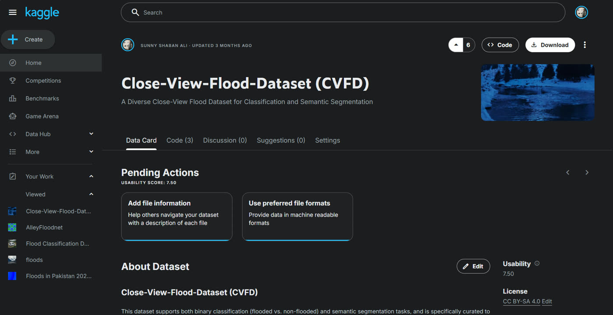
        </a>
        <br />
        <p align="center">
          <br>
          <a href="https://github.com/sunnyallana" target="_blank">
            
          </a>
        </p>
        <p>Constructed and released the <strong>Close-View Flood Dataset (CVFD)</strong> on Kaggle: 7,855 images with pixel-wise semantic segmentation masks across 3 operationally motivated rescue classes, with inter-annotator agreement of Cohen's κ = 0.81. Benchmarked 7 vision architectures on CVFD and identified fine-tuned <strong>DINOv3</strong> as optimal at <strong>98.84% accuracy (±0.08)</strong> with 21.6M parameters, matching Swin Transformer at one-quarter the parameter count. Built an agentic triage pipeline fusing a CV Agent (DINOv3 + SAM 3) with a zero-shot multilingual LM Agent into a composite priority scorer, validated via Spearman's ρ and Cohen's κ.</p>
  </td>
</tr>

<tr>
  <td width="50%" valign="top">
      <h3 align="center">LineSentry · Industrial IoT at Dawlance</h3>
        <br />
        <a target="_blank" href="https://github.com/sunnyallana">
            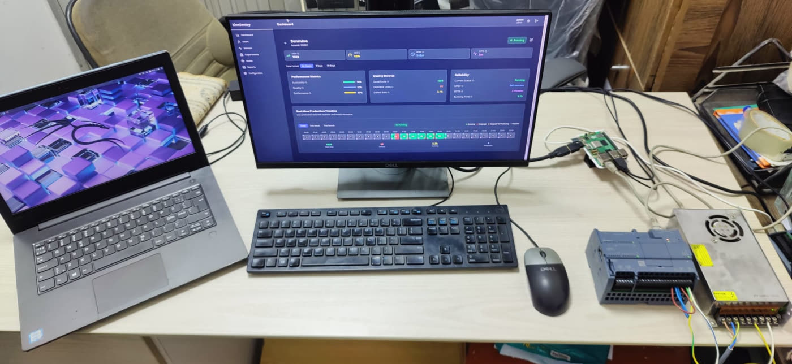
        </a>
        <br />
        <p align="center">
          <br>
          <a href="https://github.com/sunnyallana" target="_blank">
            
          </a>
        </p>
        <p>Real-time <strong>OEE / MTTR / MTBF</strong> analytics platform, a vendor-neutral replacement for costly legacy industrial monitoring (<strong>€60K saved</strong>), live on 4 injection-molding and assembly-line machines at Dawlance and designed to scale to hundreds across multiple PLCs. Per-PLC <strong>Tokio</strong> daemons on <strong>Raspberry Pi</strong> read Siemens S7 bytes via <strong>snap7-rs</strong> and POST hex frames to a <strong>Rust (Axum)</strong> backend that decodes Q{byte}.{bit} pins through a multi-PLC registry, runs a 4-state machine, and persists to <strong>MongoDB</strong> with timezone bucketed aggregations. <strong>React 18</strong> dashboards stream over <strong>Socket.IO</strong> with <strong>Recharts</strong> visualizations, guided machine setup, and SAP-linked stoppage classification; secured with JWT, reCAPTCHA, rate limiting, and RBAC, shipped via <strong>Docker Compose</strong>.</p>
  </td>
    <td width="50%" valign="top">
      <h3 align="center">Trainiac · Agentic AI Fitness at MazikGlobal</h3>
        <br />
      <a target="_blank" href="https://github.com/sunnyallana">
            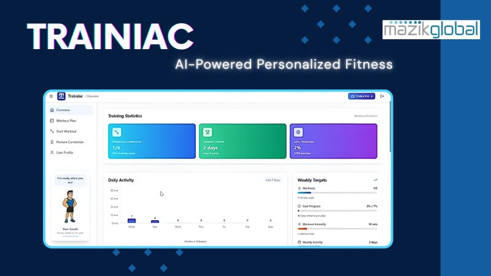
        </a>
        <br />
        <p align="center">
   <br>
  <a href="https://github.com/sunnyallana" target="_blank">
    
  </a>
      </p>
        <p>AI fitness platform anchored by a modular <strong>LangChain</strong> tool-calling agent (mood tracking, RAG-based Q&A, report generation, profile updates) with CNN-based real-time posture detection in <strong>TensorFlow</strong> at <strong>94% accuracy</strong>. Video-based workout-plan generation via <strong>FastAPI</strong> and a <strong>React</strong> progress dashboard; MongoDB-stored evolving user summaries cut chatbot response latency on repeat interactions.</p>
    </td>
  </tr>

<tr>
  <td width="50%" valign="top">
      <h3 align="center">Jild · AI Skincare Analysis · HackOps'25</h3>
        <br />
        <a target="_blank" href="https://github.com/sunnyallana">
            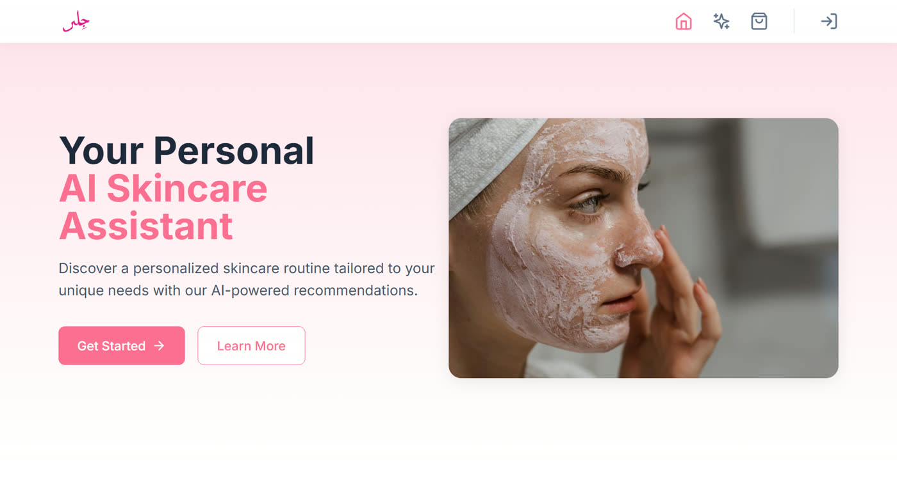
        </a>
        <br />
        <p align="center">
          <br>
          <a href="https://github.com/sunnyallana" target="_blank">
            
          </a>
        </p>
        <p><strong>1st Runner-Up at HackOps'25</strong> for an AI skincare analyzer detecting acne and dark circles at <strong>83.8% mAP@50</strong> on a ~2k-image dataset, returning severity scores and matched product/routine recommendations. <strong>React + Tailwind + MUI</strong> frontend on Vercel with a Dockerized <strong>Flask</strong> inference service and <strong>Supabase</strong>, IaC via <strong>Terraform</strong>; <strong>GitHub Actions CI/CD</strong> with SonarCloud, GitGuardian, and Dependabot held critical vulnerabilities at zero through release.</p>
  </td>
    <td width="50%" valign="top">
      <h3 align="center">Hyprland Starter · Open-Source · 880+ ★</h3>
        <br />
      <a target="_blank" href="https://github.com/mylinuxforwork/hyprland-starter">
            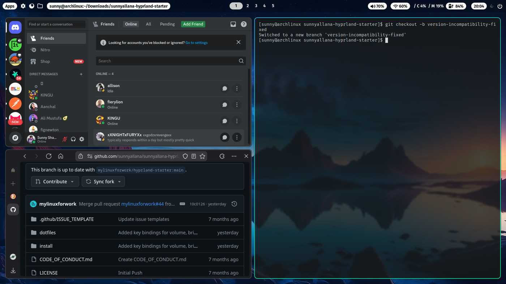
        </a>
        <br />
        <p align="center">
   <br>
  <a href="https://github.com/mylinuxforwork/hyprland-starter" target="_blank">
    
  </a>
      </p>
        <p>Contributed an open-source screenshot tool to <strong>ML4W Hyprland Starter</strong>, a popular Arch Linux desktop project (<strong>880+ GitHub stars</strong>); supports region, fullscreen, interactive, clipboard, and color-picker capture, all triggered via Print Screen shortcuts. Merged 8 keyboard shortcuts (volume, brightness, mute, microphone, WiFi, screen refresh) and a lockscreen display fix for 1920×1080 monitors, across <strong>2 pull requests upstream</strong>.</p>
    </td>
  </tr>

  <tr>
    <td width="50%" valign="top">
      <h3 align="center">Coders Cup · ACM Event Registration</h3>
        <br />
        <a target="_blank" href="https://github.com/sunnyallana/acm-nuces-web-app">
            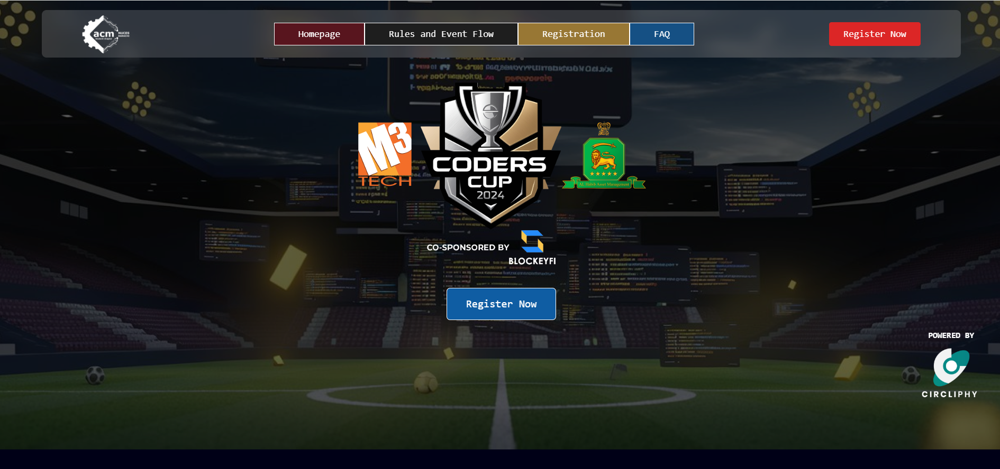
        </a>
        <br />
        <p align="center">
          <br>
          <a href="https://github.com/sunnyallana/acm-nuces-web-app" target="_blank">
            
          </a>
        </p>
        <p>Built the Coders Cup contest portal in <strong>React + Tailwind</strong> on <strong>Azure Web App</strong> with multi-field client validation and Google reCAPTCHA v2, handling <strong>2,500+ users</strong> and <strong>900+ team registrations</strong> for ACM NUCES. Ranked top-3 on Google for "Coders Cup" keywords with 9,900 page views; shipped via GitHub Actions CI/CD and awarded <strong>Special Mention</strong> for leading platform development.</p>
    </td>
    <td width="50%" valign="top">
      <h3 align="center">Automated Invoice Processor · Python OCR</h3>
        <br />
        <a target="_blank" href="https://github.com/sunnyallana/invoice-processor">
            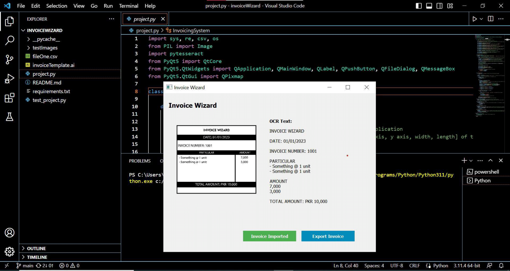
        </a>
        <br />
        <p align="center">
          <br>
  <a href="https://github.com/sunnyallana/invoice-processor" target="_blank">
    
  </a>
      </p>
        <p>AI-powered OCR tool using <strong>Python</strong>, <strong>PyTesseract</strong>, <strong>Matplotlib</strong>, and <strong>PyQt5</strong> to parse <strong>100+ invoice formats</strong> at <strong>93% accuracy</strong>, reducing manual processing time by <strong>40%</strong> through automated extraction and validation.</p>
    </td>
  </tr>
</table>

<br/>

---

<h2 align="center">📊 GitHub Analytics</h2>
  <br/><br/>

  <picture>
    <source media="(prefers-color-scheme: dark)" srcset="https://raw.githubusercontent.com/sunnyallana/sunnyallana/output/github-contribution-grid-snake-dark.svg"/>
    <source media="(prefers-color-scheme: light)" srcset="https://raw.githubusercontent.com/sunnyallana/sunnyallana/output/github-contribution-grid-snake.svg"/>
    
  </picture>

  <br/><br/>

  <a href="https://github.com/ashutosh00710/github-readme-activity-graph">
    
  </a>

</div>

<br/>

---

<div align="center">
  <h2>🥇 Certifications & Badges</h2>

  <a href="https://www.credly.com/badges/f3d58f4b-267e-43d1-b028-f2895456b5bc/public_url">
      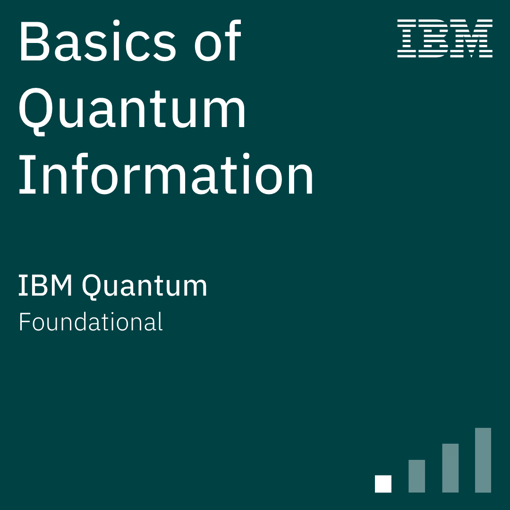
  </a>
  <a href="https://www.credly.com/badges/0dc4e5d5-9206-417d-af5e-3623613cff2b">
      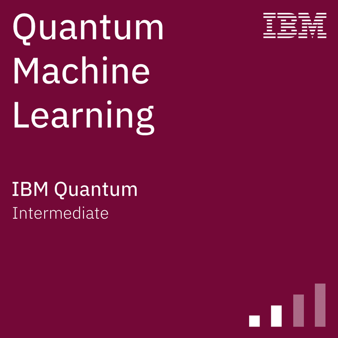
  </a>
  <a href="https://www.credly.com/badges/6d4891f3-ca73-4c4d-a414-673a2c316a6b">
      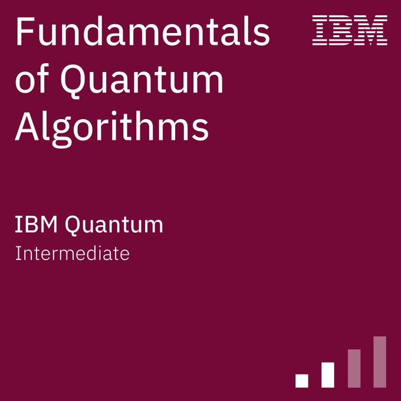
  </a>
  <a href="https://www.credly.com/badges/9cbee0d2-3508-4e38-a488-99538bf4e471/public_url">
      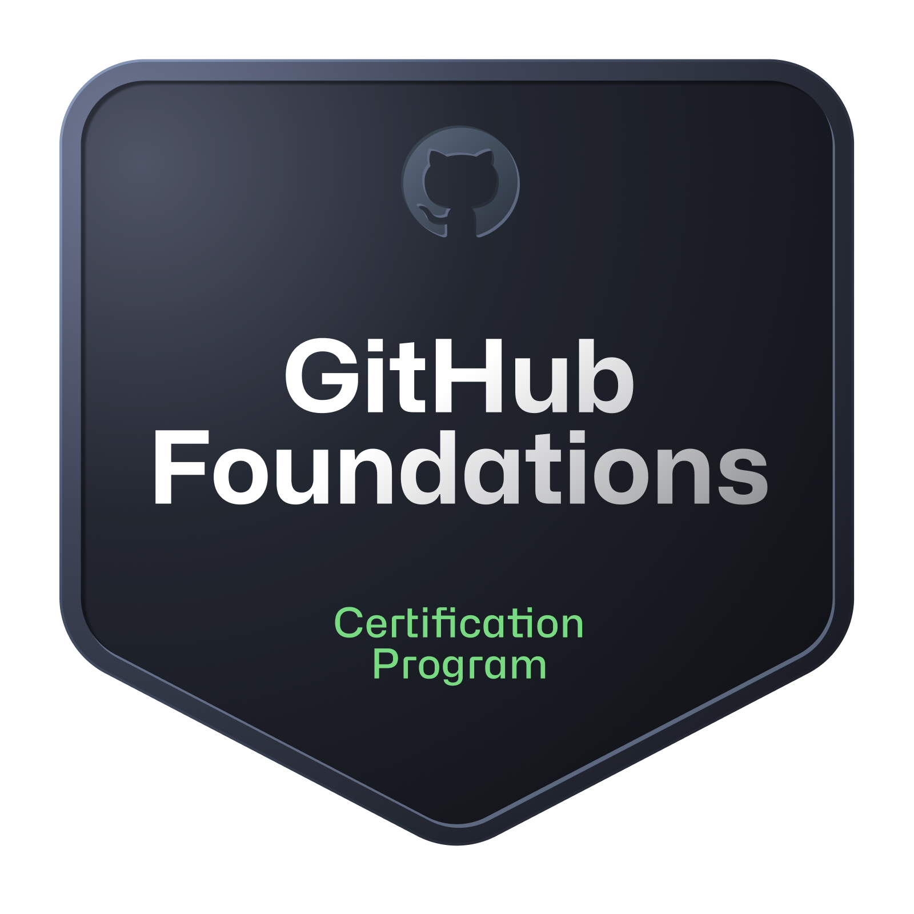
  </a>
  <a href="https://learn.microsoft.com/api/credentials/share/en-us/sunny-shaban-ali/A3737F7CB799EA99?sharingId=3082081C59931CEC">
      
  </a>
  <a href="https://learn.mongodb.com/c/6AD1UI_OT_aJ4S4FU1z3Lw">
      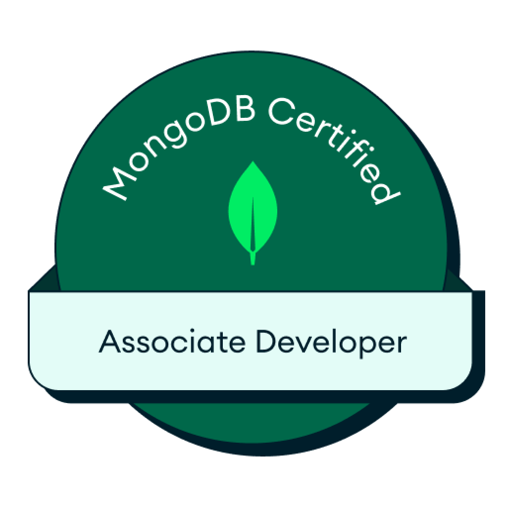
  </a>
  <a href="https://api.badgr.io/public/assertions/njHKqJJISj2qeCSh7LrpCQ?identity__email=study.sunnyallana%40gmail.com">
      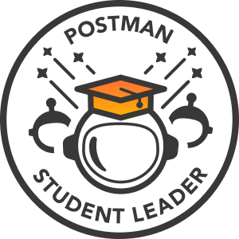
  </a>
  <a href="https://api.badgr.io/public/assertions/4NvkIsOXTy-wKBKlK8vfVQ?identity__email=study.sunnyallana%40gmail.com">
      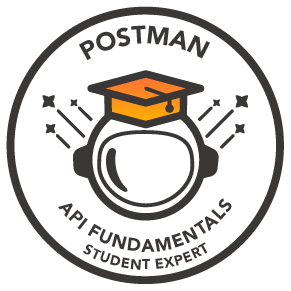
  </a>
  <a href="https://learn.microsoft.com/api/achievements/share/en-us/SunnyShabanAli-6232/9FXE4M6U?sharingId=3082081C59931CEC">
      
  </a>
  <a href="https://www.credly.com/badges/df0dba9b-e56d-482a-a652-255d8be6fd8b">
      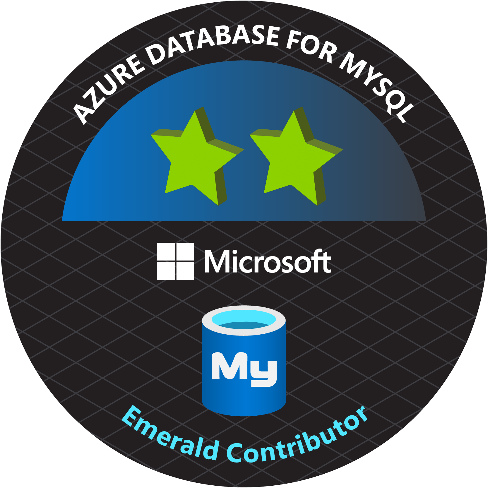
  </a>
  <a href="https://www.credly.com/badges/d14372c6-5828-4eab-8600-2c2cc01be06f">
      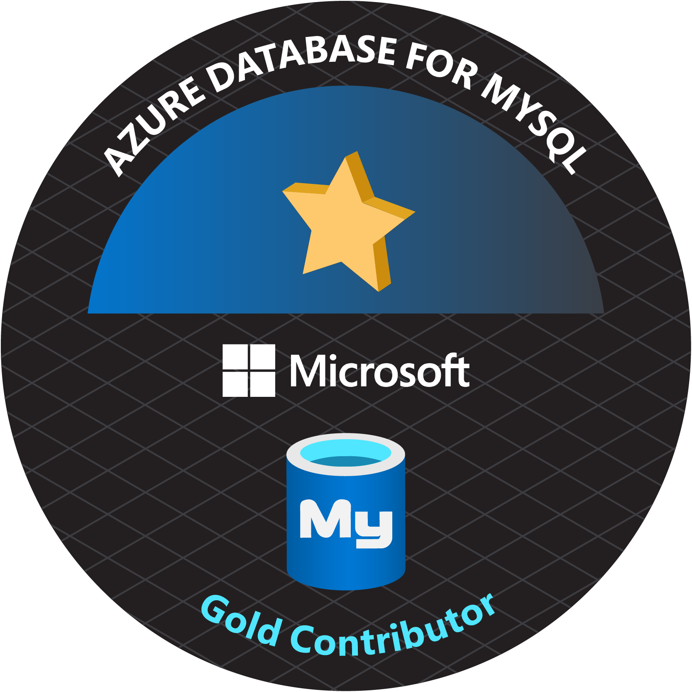
  </a>
  <a href="https://www.credly.com/badges/ab381004-8711-49b3-bd8b-11fe778d83e5">
      
  </a>
  <a href="https://www.credly.com/badges/0be18a5e-43a3-4b25-a689-7ad630578ff7">
      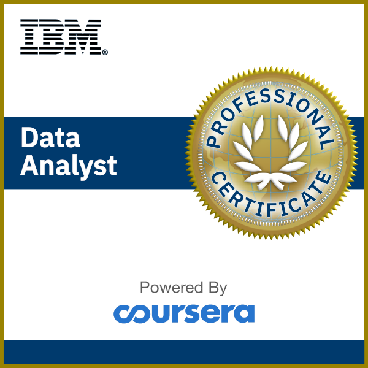
  </a>
  <a href="https://www.credly.com/badges/ae081eb5-404e-4e5a-8a1f-6f18de7b520e">
      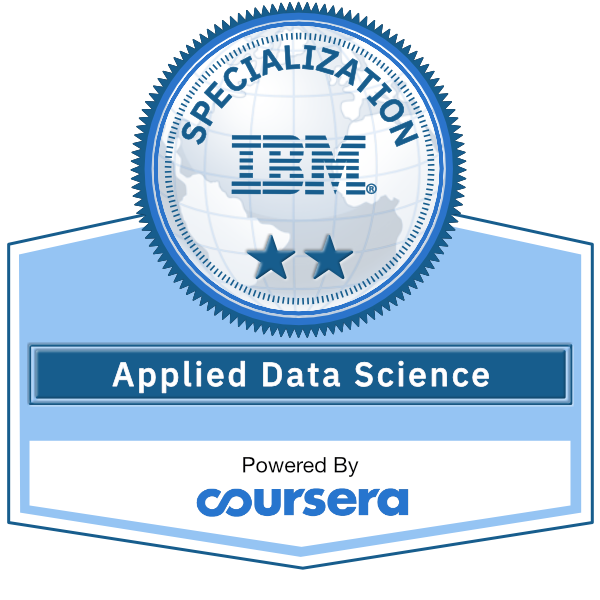
  </a>
</div>

<br/>

---

<div align="center">


<br/>

<samp>loop { build(); break_things(); refine(); } // 💜 on Arch, btw</samp>


</div>
